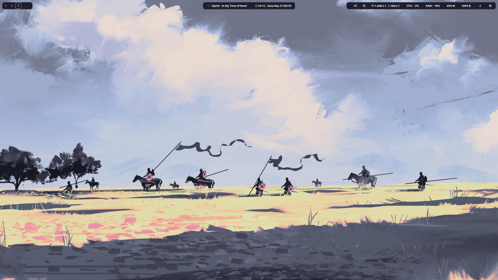

# Cyborg

## Content

Shell script to get up and running within minutes on a fresh Arch or Ubuntu installation.
Dotfiles available [here](https://github.com/H-ADJI/dotfiles)

## Setup

- install curl
- launch the following command :

```bash
curl -SL https://raw.githubusercontent.com/H-ADJI/cyborg/refs/heads/master/init.sh | bash
```

## Final product




